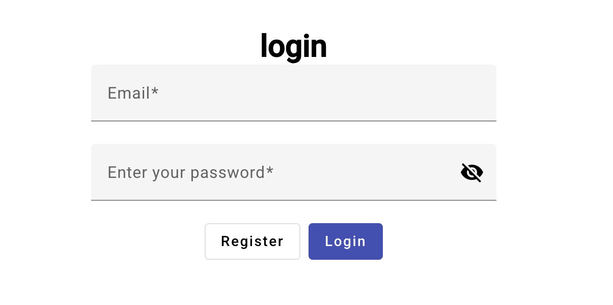

# flat-finder

This project was generated with [Angular CLI](https://github.com/angular/angular-cli) version 17.3.11.

FlatFinder is a web application designed to connect landlords and renters, allowing them to list, search, and manage rental properties. Built with Angular, this project provides an intuitive and responsive interface for users to find and manage flats efficiently.

## Features

- User Authentication: Register, log in, and manage user profiles.
- Property Listings: Landlords can add, edit, and delete their rental listings.
- Search & Filter: Renters can browse flats with filtering options (city, price, size, etc.).
- Favorites: Users can mark/unmark flats as favorites for easy access.
- Messaging System: Renters can send messages to landlords regarding a specific listing.
- Admin Panel: Admin users can manage all users, edit profiles, and grant admin permissions.

## Technologies

Frontend: Angular, TypeScript, HTML, CSS
Backend: Firebase (Firestore for database, Firebase Functions for API)
Hosting: Firebase Hosting

## Login Details

- Admin:
- email: test@testmail.com
- password: test123 

- User:
- email: user@testmail.com
- password: user123

</img>

## Register
- email: required
- password: required, minimum length is 5
- firstName: required
- lastName: required

## Development server

1. Clone the repository `git clone https://github.com/Joyce-Huang-CH/FlatFinder.git`
2. `cd flatfinder` 
3. Install dependencies: `npm install`
4. Run `ng serve` for a dev server. Navigate to `http://localhost:4200/`. The application will automatically reload if you change any of the source files.

## Code scaffolding

Run `ng generate component component-name` to generate a new component. You can also use `ng generate directive|pipe|service|class|guard|interface|enum|module`.

## Build

Run `ng build` to build the project. The build artifacts will be stored in the `dist/` directory.

## Running unit tests

Run `ng test` to execute the unit tests via [Karma](https://karma-runner.github.io).

## Running end-to-end tests

Run `ng e2e` to execute the end-to-end tests via a platform of your choice. To use this command, you need to first add a package that implements end-to-end testing capabilities.

## Further help

To get more help on the Angular CLI use `ng help` or go check out the [Angular CLI Overview and Command Reference](https://angular.io/cli) page.
